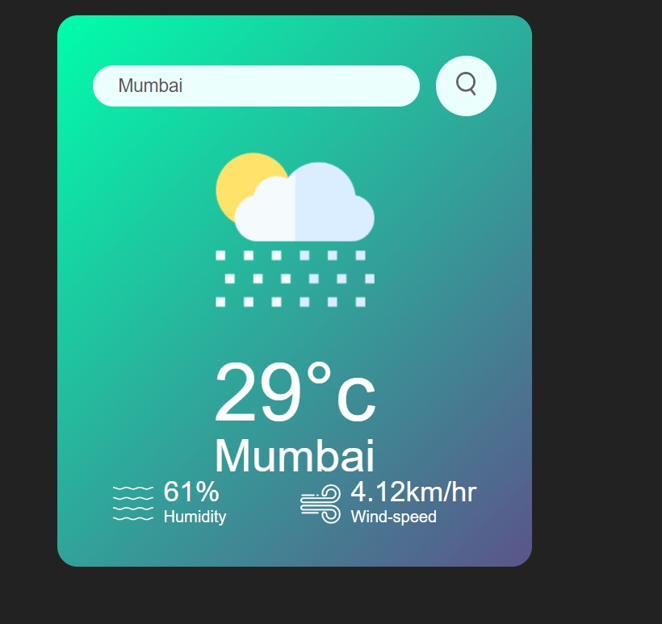

# Weather App

This project is a simple web-based weather application that fetches and displays current weather data for a city using the OpenWeatherMap API. Users can search for any city and get real-time weather information, including temperature, humidity, wind speed, and weather conditions (such as clear, cloudy, rainy, etc.).

## Features

- Displays current temperature, humidity, and wind speed for a city.
- Weather icon updates based on the current weather conditions (e.g., clear, rain, clouds, etc.).
- Responsive user interface with search functionality.

## Screenshots

Include screenshots or gifs of your project in action (if available).

---

## Technologies Used

- **HTML5**: Structure of the app.
- **CSS3**: Styling for the UI.
- **JavaScript (ES6)**: Logic and API requests.
- **OpenWeatherMap API**: Provides real-time weather data.
  
---

## How to Use

1. **Clone the repository**:
   ```bash
   git clone https://github.com/gaurav19060/Weather-App.git
   ```
   
2. **Navigate to the project directory**:
   ```bash
   cd Weather-App
   ```

3. **Install Dependencies**:
   There are no external dependencies required for this project.
   
4. **Run the project**:
   You can open `index.html` directly in your browser or use a simple HTTP server (like Python’s `http.server`) to run it locally:
   
   ```bash
   python -m http.server
   ```
   
   Open your browser and go to `http://localhost:8000/`.

---

## Setup Instructions for API Key

This app uses the OpenWeatherMap API. To get your own API key:

1. Sign up at [OpenWeatherMap](https://openweathermap.org/) to get your API key.
2. Create a `config.js` file in the project directory to store your API key:
   ```javascript
   const apikey = "YOUR_API_KEY_HERE";
   export { apikey };
   ```

3. Make sure your `.gitignore` includes `config.js` to keep your API key private:
   ```bash
   config.js
   ```

---

## Contributing

1. Fork the repository.
2. Create your feature branch: `git checkout -b feature/my-feature`.
3. Commit your changes: `git commit -m 'Add some feature'`.
4. Push to the branch: `git push origin feature/my-feature`.
5. Open a pull request.

## Screenshots

